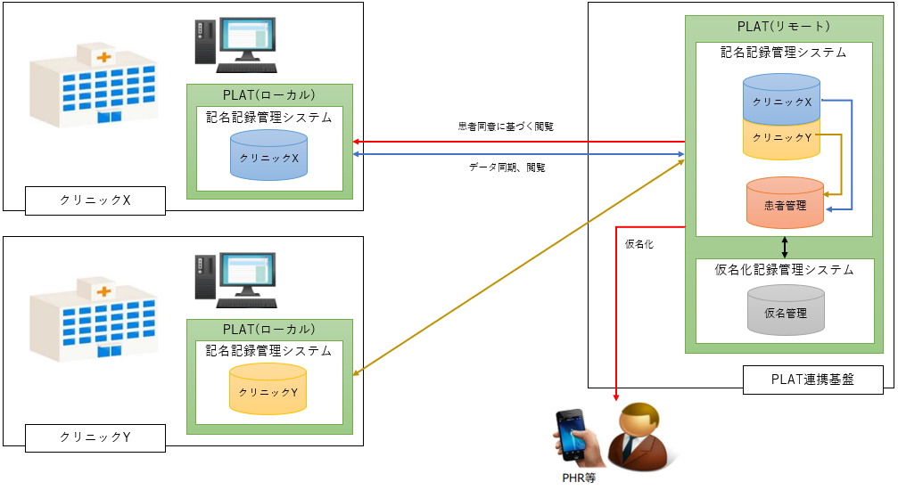

[[_TOC_]] 

----

# 1. システム構成図（参照実装時の例）

# 2. 各環境の役割
## 2.1. ローカル
各医療機関側に設置するPLATのシステム

## 2.2. リモート
患者が利用するPLATシステム
各医療機関のマスタとしての役割も果たす

# 3. 今回の動作環境構築の想定
## 3.1. 概要
本手順では１つのOS上でDockerを用いて簡易的にLocal-Remoteの環境を作成する手順を記載する。

## 3.2. 簡易構成

## 3.3. 詳細構成

# 4. ミドルウェアの役割
## 4.1. Keycloak
PLATでの認証（シングルサインオン）基盤として利用。

## 4.2. PostgreSQL
各種アプリケーション、ミドルウェアのデータベースとして利用。

## 4.3. RabbitMQ
データ同期処理においてローカルからリモートへJSON形式のデータを連携するために利用。

# 5. アプリケーションの役割
## 5.1. plat-gateway
認証基盤で発行したトークンを基にPLATの認可機能を提供する。

## 5.2. plat-api
PLATにおける業務APIを提供する。
機能詳細については[API一覧](5.API仕様/1.API一覧.md)を参照。

## 5.3. plat-mq
PLATのLocal→Remote連携用メッセージキューイング処理用バッチ。  
LocalのRabbitMQからキューを取得し、Remoteのplat-apiに連携する。

## 5.4. plat-autoapproval
PLATの文書自動承認処理バッチ。  
文書登録から一定期間経過したデータを取得し、自動承認する。

## 5.5. plat-sync
PLATのRemote→Local連携用バッチ。  
リソース連携管理テーブルに登録されたデータを取得し連携する。

## 5.6. plat-cleaning
PLATのLocal用データクリーニングバッチ。  
登録から一定期間経過したデータを取得し、削除する。

