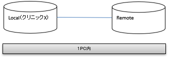
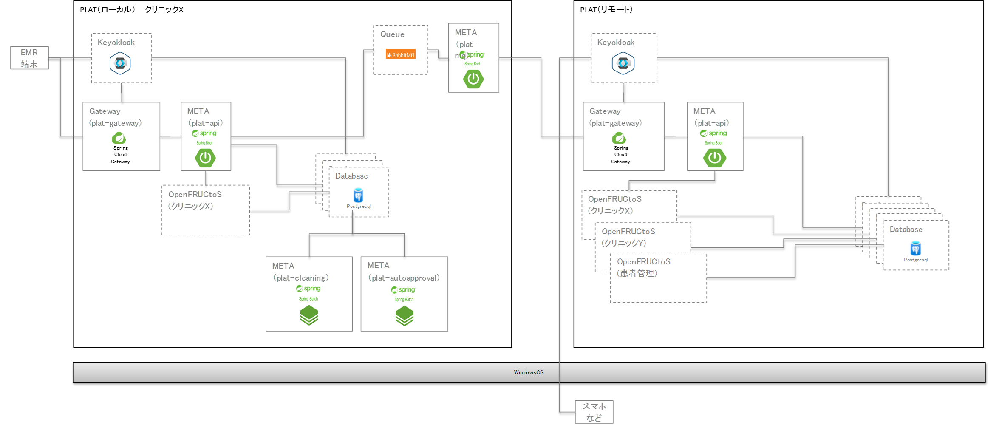

[[_TOC_]] 

----

# 1. 概要
本手順では１つのOS上でローカル及びリモートの動作環境を構築する手順を記載する。

# 2. 構成
本手順を実施することで以下の環境をローカルPC上に構築する。

## 2.1. 簡易構成

## 2.2. 詳細構成

# 3. 環境情報
  | 環境名 | フォルダ名 | メモリ使用量 |
  | --- | --- | --- |
  | リモート環境 | remote | 4 GB |
  | ローカル環境X | localX | 5 GB |

# 4. 手順
## 4.1. Dockerの実行（remote）
[4.技術資料 / 1.操作方法関連資料 / 1.Docker環境の構築手順](../4.技術資料/1.操作方法関連資料/1.Docker環境の構築手順.md)

## 4.2. Dockerの実行（localX）
[4.技術資料 / 1.操作方法関連資料 / 1.Docker環境の構築手順](../4.技術資料/1.操作方法関連資料/1.Docker環境の構築手順.md)

## 4.3. 動作確認
[3.利用手順 / 1.Postmanでのアプリケーション疎通確認](../3.利用手順/1.Postmanでのアプリケーション疎通確認.md)

----
前へ [[1.動作環境を構築する](1.動作環境を構築する.md)]  
次へ [[3.医療機関を追加する](3.医療機関を追加する.md)]
