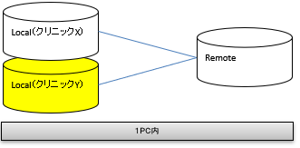
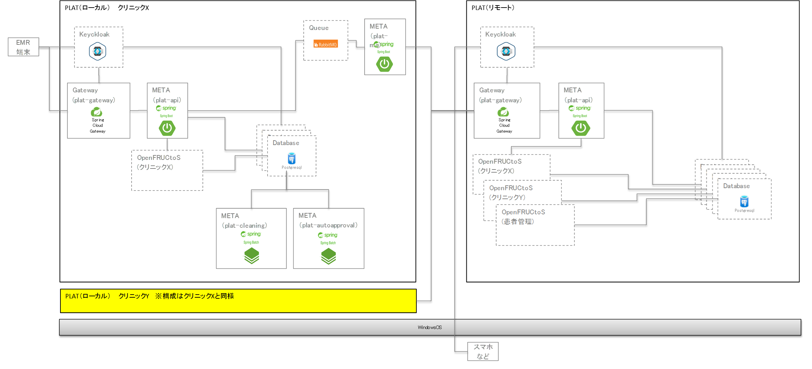

# 1. 概要
本手順では「2.新規に基盤を構築する」にて環境構築後に新たな医療機関を追加する手順を記載する。

# 2. 構成
本手順を実施することで以下の医療機関（黄色の網掛け）をローカルPC上に追加構築する。

## 2.1. 簡易構成

## 2.2. 詳細構成

# 3. 環境情報
  | 環境名 | フォルダ名 | メモリ使用量 |
  | --- | --- | --- |
  | ローカル環境Y | localY | 5 GB |

# 4. 手順
## 4.1. Dockerの実行（localY）
[4.技術資料 / 1.操作方法関連資料 / 2.Docker環境の医療機関追加手順](../4.技術資料/1.操作方法関連資料/2.Docker環境の医療機関追加手順.md)

## 4.2. 動作確認
[3.利用手順 / 1.Postmanでのアプリケーション疎通確認](../3.利用手順/1.Postmanでのアプリケーション疎通確認.md)

----
前へ[[2.新規に基盤を構築する](2.新規に基盤を構築する.md)
