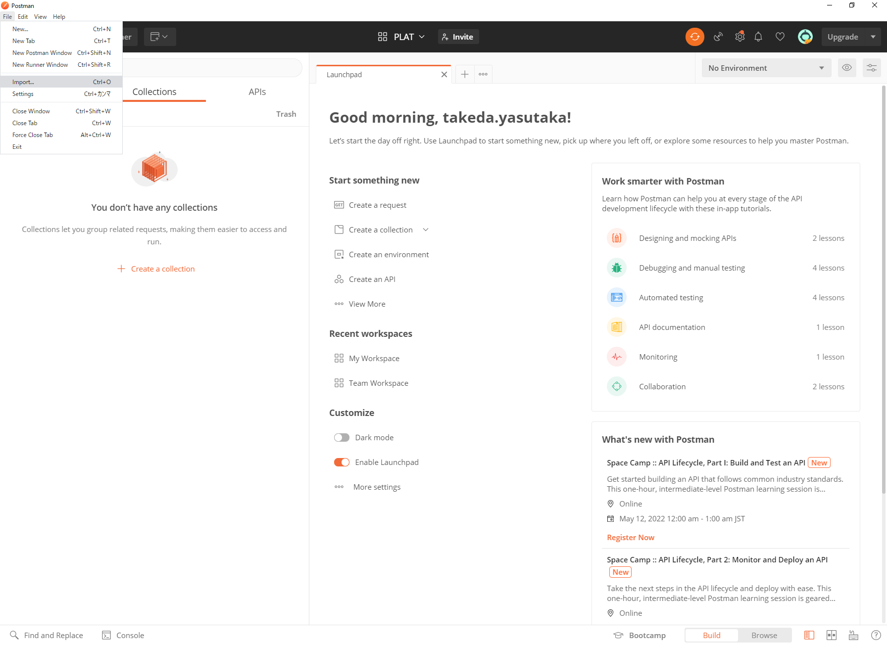
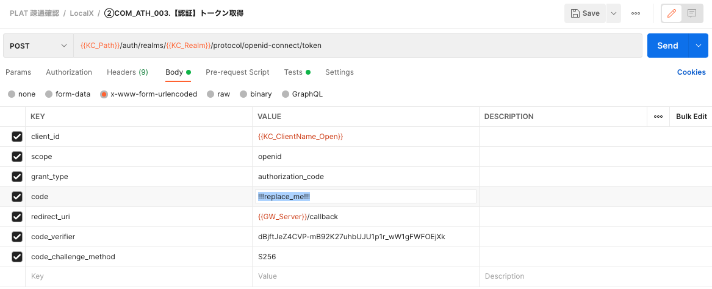
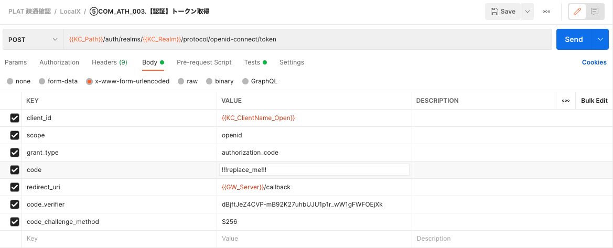

[[_TOC_]] 

----

# 1. 概要
PLAT環境の構築後に動作確認をするための手順を記載する。

# 2. 事前準備
- Postmanのインストール  

# 3. 手順
## 3.1. Postmanに設定ファイルを読み込む
1. Postmanを起動し[File] [Import] を押下する。  
  

1. [Upload Files] を押下し、処理定義（2.セットアップ手順/3.利用手順/contents配下）のファイルをインポートする。  
   - PLAT 疎通確認.postman_collection.json  

1. [Upload Files] を押下し、環境変数（2.セットアップ手順/3.利用手順/contents配下）のファイルをインポートする。  
   - PLAT リリース環境.postman_environment.json  

## 3.3. KeyCloakの設定  
管理コンソールからユーザを登録（詳細な手順は [KeyCloakへのユーザ登録手順](../4.技術資料/1.操作方法関連資料/4.KeyCloakへのユーザ登録.md) を参照）  
   1. 左のメニューからUsersを開き、localclinicx.adminユーザを生成する。（ユーザ名、メールアドレスは任意で良い）  

   2. 再びUsersを開き、View all usersを押下すると作成したユーザが表示される。  

   3. ユーザのリンクをクリックし、Credentialsタブでパスワードを設定する。  
   （値はlocalclinicx.admin、TemporaryはOFFにしてReset Passwordを押下する）

## 3.4. Postmanの実行（ユーザ認証〜APIアクセスまで各環境の一気通貫確認）
1. ユーザ認証（管理ユーザ：localclinicx.admin）  
   1.1. Postmanの [PLAT 疎通確認] - [LocalX] - [①COM_ATH_001.【認証】認証エンドポイント] を開き、Sendボタンを押下する。  
   1.2. PostmanのConsoleに以下の様なURLが生成されるので、"http"以降をコピーしてWebブラウザで開く。  
   ```
   GET http://localhost:8184/auth/realms/1310000001/protocol/openid-connect/auth?client_id=plat-public&scope=openid&response_type=code&redirect_uri=http://localhost:18182/callback&code_challenge=E9Melhoa2OwvFrEMTJguCHaoeK1t8URWbuGJSstw-cM&code_challenge_method=S256
   ```

   1.3. localclinicx.adminでサインインすると画面に認可コードが表示されるのでクリップボード等に保持しておく。  
   ```
   8979899a-8a6e-4155-9115-d3dfe23b64af.b76fe821-d095-4a30-86d0-74f1dd5d8471.5a3c96e3-34cd-4dd6-a984-ff868b4f0eea
   ```

   1.4. Postmanの [PLAT 疎通確認] - [LocalX] - [②COM_ATH_003.【認証】トークン取得] を開き、Bodyタブのcode（下図!!!replace_me!!!の箇所）に1.3. で取得した認可コードを設定してSendボタンを押下する。  
     

2. スタッフの登録  
   2.1. Postmanの [PLAT 疎通確認] - [LocalX] - [③PRV_STF_003.【登録】スタッフ管理（認証情報まで一括登録）] を開き、Sendボタンを押下する。  
   ※ 正常にレスポンスが返ってくればID：localclinicx.doctor0001、パスワード：localclinicx.doctor0001のユーザがKeyCloakに登録されている。

3. ユーザ認証（スタッフ：localclinicx.doctor0001）  
   3.1. Postmanの [PLAT 疎通確認] - [LocalX] - [④COM_ATH_001.【認証】認証エンドポイント] を開き、Sendボタンを押下する。  
   3.2. PostmanのConsoleに以下の様なURLが生成されるので、"http"以降をコピーしてWebブラウザで開く。  
   ```
   GET http://localhost:8184/auth/realms/1310000001/protocol/openid-connect/auth?client_id=plat-public&scope=openid&response_type=code&redirect_uri=http://localhost:18182/callback&code_challenge=E9Melhoa2OwvFrEMTJguCHaoeK1t8URWbuGJSstw-cM&code_challenge_method=S256
   ```

   3.3. localclinicx.doctor0001でサインインすると画面に認可コードが表示されるのでクリップボード等に保持しておく。  
   ```
   8979899a-8a6e-4155-9115-d3dfe23b64af.b76fe821-d095-4a30-86d0-74f1dd5d8471.5a3c96e3-34cd-4dd6-a984-ff868b4f0eea
   ```

   3.4. Postmanの [PLAT 疎通確認] - [LocalX] - [⑤COM_ATH_003.【認証】トークン取得] を開き、Bodyタブのcode（下図!!!replace_me!!!の箇所）に3.3. で取得した認可コードを設定してSendボタンを押下する。  
     

4. 組織一覧を取得  
   Postmanの [PLAT 疎通確認] - [LocalX] - [⑥PRV_ORG_001.【取得】文書情報が存在する医療機関リスト] を開き、Sendボタンを押下する。  
   ※ここで正常にレスポンスが返ってくればplat-gateway → KeyCloak → plat-api(LocalX) → plat-api(Remote) → OpenFRUCtoS(Remote)の一気通貫が確認完了。


