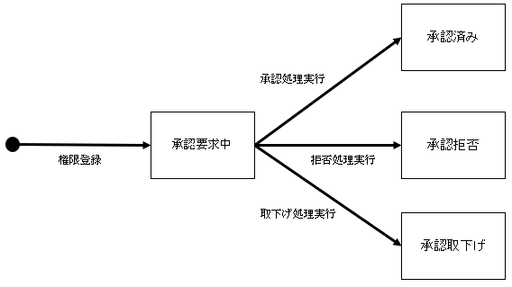

[[_TOC_]] 

----

# 1. 権限管理について
PLAT内では各データに対して付与された権限のパターン、権限の有効性によってアクセス可能か判定している。

# 2. 権限の状態遷移

| ステータス | 条件 | 権限の有効性 | 
| :--- | :--- | :--: | 
| 承認要求中 | 権限の新規登録 | × |
| 承認済み | 承認要求中に権限承認処理を実行 | 〇 |
| 承認拒否 | 承認要求中に権限拒否処理を実行 | × |
| 承認取下げ | 承認要求中に権限取下げ処理を実行 | × |